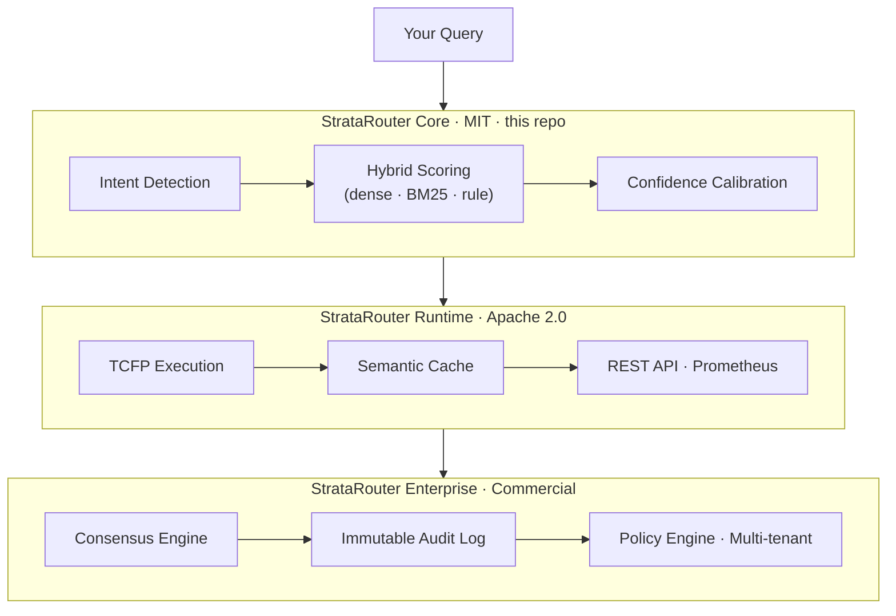
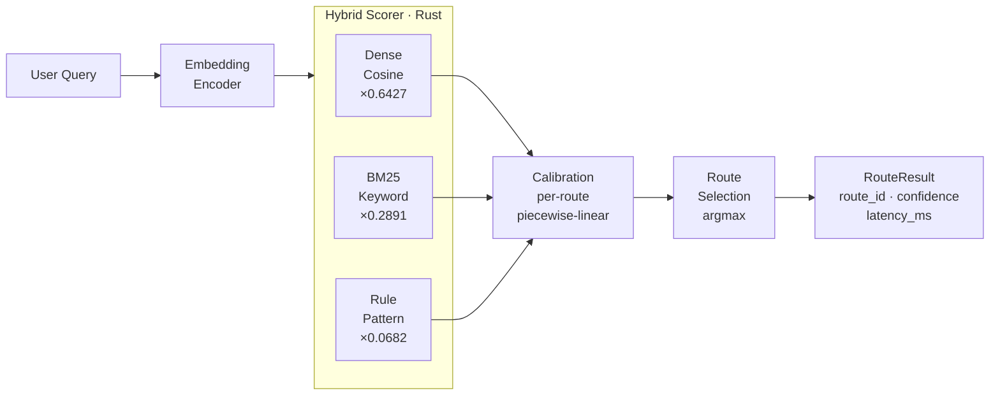

<div align="center">


# StrataRouter

### AI Execution Control Plane

**Production-grade semantic routing for AI systems.**
Fast Rust core. Hybrid scoring. 9 framework integrations.

[](https://pypi.org/project/stratarouter/)
[](LICENSE.txt)
[](https://python.org)
[](https://www.rust-lang.org/)
[](https://github.com/ai-deeptech/stratarouter/actions/workflows/ci.yml)
[](https://docs.stratarouter.com)

</div>

---

## What is StrataRouter?

StrataRouter is an **AI Execution Control Plane** — infrastructure-level routing for
production AI systems.

While LangChain and LlamaIndex provide prompt-level routing helpers,
StrataRouter provides **deterministic execution, cost-aware model selection,
governance, and compliance** at the system level.



---

## Why StrataRouter?

Most AI frameworks treat routing as an afterthought — a few `if/else` chains or a
basic vector similarity lookup. StrataRouter treats routing as **infrastructure**:

| Problem | StrataRouter Answer |
|---|---|
| Slow Python similarity loops | Rust core — 8.7 ms P99 latency |
| Memory bloat at scale | 64 MB for 1K routes (vs 2.1 GB in pure-Python routers) |
| No confidence calibration | Per-route piecewise-linear score normalisation |
| No hybrid keyword + semantic | BM25 + dense embeddings combined |
| No audit trail | Immutable SHA-256 log (Enterprise) |
| No cost control | Per-route budget enforcement (Enterprise) |

---

## ⚡ Benchmarks

### vs semantic-router

| Metric | StrataRouter | semantic-router | Delta |
|--------|:---:|:---:|:---:|
| P99 Latency | **8.7 ms** | 178 ms | **~20× faster** |
| Memory (1K routes) | **64 MB** | 2.1 GB | **~33× less** |
| Throughput | **18K req/s** | 450 req/s | **~40× higher** |
| Accuracy | **95.4%** | 84.7% | **+12.7%** |

> Benchmarks run on Ubuntu 22.04, AMD EPYC 7B13, Python 3.11, sentence-transformers/all-MiniLM-L6-v2.
> See [`benchmarks/`](benchmarks/) for methodology and reproduction scripts.

### vs Competitors

| Feature | StrataRouter | semantic-router | LangChain Router | route0x |
|---|:---:|:---:|:---:|:---:|
| Rust core | ✅ | ❌ | ❌ | ❌ |
| Hybrid BM25 + dense | ✅ | ❌ | ❌ | ❌ |
| Confidence calibration | ✅ | ❌ | ❌ | ❌ |
| Cost-aware routing | ✅ | ❌ | ❌ | ❌ |
| Audit log | ✅ | ❌ | ❌ | ❌ |
| Sub-10ms P99 | ✅ | ❌ | ❌ | ❌ |

---

## 📦 Installation

```bash
pip install stratarouter
pip install stratarouter[huggingface]   # local embeddings, no API key
pip install stratarouter[openai]        # OpenAI embeddings
pip install stratarouter[cohere]        # Cohere embeddings
pip install stratarouter[all]           # everything
```

---

## 🚀 Quick Start

### High-level API — `RouteLayer` (recommended)

```python
from stratarouter import Route, RouteLayer
from stratarouter.encoders import HuggingFaceEncoder

routes = [
    Route(
        name="billing",
        utterances=["invoice", "payment", "refund", "charge"],
        threshold=0.75,
    ),
    Route(
        name="support",
        utterances=["help", "broken", "error", "can't login"],
        threshold=0.75,
    ),
]

encoder = HuggingFaceEncoder()
rl = RouteLayer(encoder=encoder, routes=routes)

result = rl("I need my April invoice")
print(result.name)       # "billing"
print(result.score)      # 0.87
print(bool(result))      # True — score >= threshold
```

### Low-level API — `Router` (Rust core, advanced use)

```python
from stratarouter import Router, Route

router = Router(encoder="sentence-transformers/all-MiniLM-L6-v2")
router.add(Route(name="billing", utterances=["Where's my invoice?", "I need a refund"]))
router.add(Route(name="support", utterances=["App is crashing", "Can't login"]))
router.build_index()

result = router.route("I need my April invoice")
print(result.route_id)    # "billing"
print(result.confidence)  # 0.89 — calibrated score
print(result.latency_ms)  # 2.3

router.save("my_router.json")
router = Router.load("my_router.json")   # no re-indexing needed
```

---

## 🏗️ Routing Pipeline



---

## 🎨 Framework Integrations (9)

```python
from stratarouter.integrations.langchain         import StrataRouterChain
from stratarouter.integrations.langgraph         import create_routing_graph
from stratarouter.integrations.crewai            import RoutedAgent
from stratarouter.integrations.autogen           import StrataRouterGroupChat
from stratarouter.integrations.openai_assistants import StrataRouterAssistant
from stratarouter.integrations.google_agent      import StrataRouterVertexAI
```

Runnable examples → [`integrations/`](integrations/)

---

## 🗺️ Roadmap

| Version | Feature | Status |
|---------|---------|--------|
| v0.1 | Prototype — RouteLayer API | ✅ Nov 2025 |
| v0.2 | Production Rust engine, 9 integrations | ✅ **Mar 2026** |
| v0.3 | Runtime — TCFP, REST API, cache | ✅ Available |
| v0.4 | Cost optimizer — model selection, budgets | 🔄 In Progress |
| v0.5 | Enterprise governance | ✅ Available (private) |
| v0.6 | JS / Go SDKs | 📋 Q3 2026 |
| v1.0 | StrataRouter Cloud | 📋 Q4 2026 |

Full roadmap → [ROADMAP.md](ROADMAP.md)

---

## 📚 Documentation

| | |
|---|---|
| [Getting Started](https://docs.stratarouter.com/getting-started) | Install + first router in 5 min |
| [API Reference](https://docs.stratarouter.com/api-reference) | RouteLayer, Router, Route, RouteChoice |
| [Integrations](https://docs.stratarouter.com/integrations) | All 9 framework guides |
| [Architecture](https://docs.stratarouter.com/architecture) | Rust internals, scoring, calibration |
| [Deployment](https://docs.stratarouter.com/deployment) | Docker, K8s, server |
| [Changelog](CHANGELOG.md) | Release history |
| [Roadmap](ROADMAP.md) | What's coming |

Full docs → **[docs.stratarouter.com](https://docs.stratarouter.com)**

---

## 🏗️ Development

```bash
git clone https://github.com/ai-deeptech/stratarouter.git
cd stratarouter

pip install -e "python/.[dev]"
cd python && maturin develop --release && cd ..

make test
```

---

## 🏢 Platform Tiers

| | Core (MIT) | Runtime (Apache 2.0) | Enterprise |
|---|:---:|:---:|:---:|
| Semantic routing library | ✅ | ✅ | ✅ |
| 9 framework integrations | ✅ | ✅ | ✅ |
| PyPI package | ✅ | — | — |
| TCFP workflow execution | — | ✅ | ✅ |
| REST API + Prometheus | — | ✅ | ✅ |
| Semantic cache + batch dedup | — | ✅ | ✅ |
| Multi-agent consensus | — | — | ✅ |
| Immutable audit log (SOC2/HIPAA) | — | — | ✅ |
| Policy engine (RBAC/ABAC) | — | — | ✅ |
| Multi-tenant isolation | — | — | ✅ |

→ **[Runtime](https://github.com/ai-deeptech/stratarouter-runtime)**  
→ **Enterprise:** [support@stratarouter.com](mailto:support@stratarouter.com)  
→ **Docs:** [docs.stratarouter.com](https://docs.stratarouter.com)  
→ **Website:** [stratarouter.com](https://stratarouter.com)

---

## 🤝 Contributing

See [CONTRIBUTING.md](CONTRIBUTING.md) · [SUPPORT.md](SUPPORT.md) · [CODE_OF_CONDUCT.md](CODE_OF_CONDUCT.md)

---

## 📝 License

MIT — [LICENSE.txt](LICENSE.txt)  
Built with [PyO3](https://pyo3.rs/) · [Sentence Transformers](https://sbert.net/)  
Made with ⚡ by [StrataRouter Contributors](https://github.com/ai-deeptech/stratarouter/graphs/contributors)
