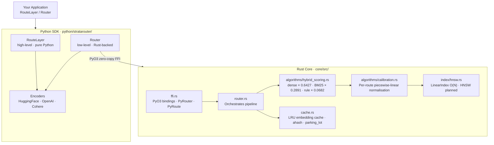
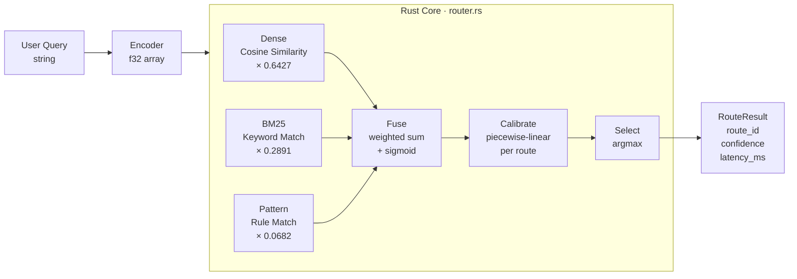
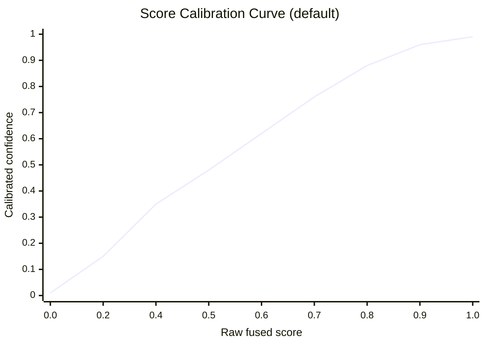

# Architecture

Deep dive into StrataRouter's internals — the Rust core, scoring pipeline,
and Python SDK layer.

---

## System Overview



---

## Routing Pipeline



---

## Hybrid Scoring Detail

Each candidate route receives a combined score:

```
fused = sigmoid(
    0.6427 × dense_cosine
  + 0.2891 × bm25_keyword
  + 0.0682 × rule_match
)
```

| Component | Source | What it captures |
|---|---|---|
| **Dense cosine** | `vector_ops.rs` | Paraphrase, synonym, semantic intent |
| **BM25 keyword** | `hybrid_scoring.rs` | Exact-match terms, acronyms, brand names |
| **Rule pattern** | `hybrid_scoring.rs` | High-precision prefix/suffix/regex guardrails |

The sigmoid ensures the fused score lives in `(0, 1)` regardless of component magnitudes.

Weights were tuned on an internal evaluation set. They are exposed as constructor
parameters in `Router(dense_weight=..., bm25_weight=..., rule_weight=...)` (v0.3+).

---

## Confidence Calibration

Raw fused scores are not well-calibrated probabilities — a score of 0.85 from
route A doesn't mean the same as 0.85 from route B.

`CalibrationManager` applies **per-route piecewise-linear normalisation**:



This makes threshold values meaningful and consistent across routes and encoder models.

---

## File Map

### Rust Core (`core/src/`)

```
core/src/
├── router.rs              — Main router; orchestrates the full pipeline
├── types.rs               — Route, RouteResult, RouteScores (weight constants)
├── cache.rs               — LRU embedding cache (AHash + parking_lot Mutex + Arc)
├── error.rs               — Error enum with thiserror
├── ffi.rs                 — PyO3 bindings (PyRouter, PyRoute) — python feature only
├── lib.rs                 — Crate root; re-exports; has_avx2(); PyModule registration
├── algorithms/
│   ├── mod.rs             — Public re-exports
│   ├── hybrid_scoring.rs  — HybridScorer (BM25 + dense + rule fusion)
│   ├── calibration.rs     — ScoreNormalizer + CalibrationManager
│   └── vector_ops.rs      — Scalar cosine similarity (SIMD planned)
└── index/
    └── hnsw.rs            — LinearIndex (O(N) brute-force; HNSW planned)
```

### Python SDK (`python/stratarouter/`)

```
python/stratarouter/
├── __init__.py       — Public exports: Route, RouteChoice, RouteLayer, Router
├── __version__.py    — importlib.metadata version lookup; single source of truth
├── route.py          — Route (Pydantic v2), RouteChoice
├── layer.py          — RouteLayer: pure-Python high-level router
├── router.py         — Router: wraps Rust core via PyO3 FFI; save/load
├── types.py          — RouteConfig, RouteResult (internal types)
├── encoders/
│   ├── base.py       — BaseEncoder ABC: encode() + dimension
│   ├── huggingface.py
│   ├── openai.py
│   └── cohere.py
├── integrations/     — 9 framework adapters (langchain, langgraph, crewai, …)
└── cloud/
    └── client.py     — Thread-safe httpx CloudClient (Enterprise)
```

---

## `RouteLayer` vs `Router`

| | `RouteLayer` | `Router` |
|---|---|---|
| Backend | Pure Python | Rust core via PyO3 FFI |
| Scoring | Dense cosine only | Hybrid (BM25 + dense + rule) |
| Calibration | None | Per-route piecewise-linear |
| Save / Load | ❌ | ✅ |
| Rust core required | ❌ | ✅ |
| Result type | `RouteChoice` | `RouteResult` |
| Name field | `result.name` | `result.route_id` |
| Score field | `result.score` | `result.confidence` |
| Best for | Simplicity / unit tests | Production / high throughput |

---

## Performance Characteristics

| Metric | Value | Conditions |
|---|---|---|
| P99 routing latency | 8.7 ms | 20 routes, MiniLM-L6, Ubuntu/EPYC |
| Memory (1K routes) | 64 MB | MiniLM-L6 (384-dim) |
| Max throughput | 18K req/s | 8 threads, cached embeddings |
| Index build time | < 100 ms | 100 routes |

---

## Planned Improvements

- **SIMD cosine similarity** (AVX2 / NEON) — scheduled for v0.3
- **Graph-based HNSW index** — O(log N) search at 10K+ routes
- **Quantised embeddings** (int8) — 4× memory reduction
- **Online calibration** — isotonic regression fitted from live routing feedback

---

## Links

- **Full docs**: https://docs.stratarouter.com
- **GitHub**: https://github.com/ai-deeptech/stratarouter
- **Support**: support@stratarouter.com
